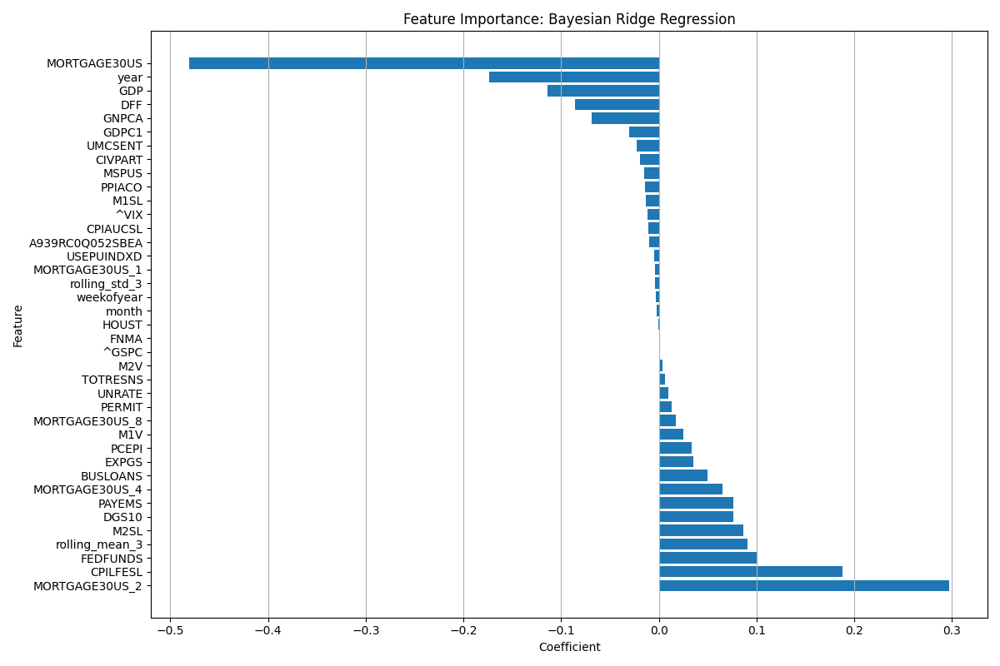

# Mortgage Rate Prediction

A machine learning project to predict 30-year fixed mortgage rates using economic indicators and Federal Reserve data.


## Overview

This project uses various economic indicators and Federal Reserve data to predict future mortgage rates. It implements a Bayesian Ridge Regression model to capture uncertainties in predictions and relationships between different economic factors.

- [Mortgage Rate Prediction](#mortgage-rate-prediction)
  * [Overview](#overview)
  * [Sample Results (April 2025)](#sample-results--april-2025-)
  * [Features](#features)
  * [Project Structure](#project-structure)
  * [Setup](#setup)
  * [Usage](#usage)
    + [Running the Prediction Pipeline](#running-the-prediction-pipeline)
    + [Automated Weekly Predictions](#automated-weekly-predictions)
  * [Model Details](#model-details)
  * [Model Selection and Performance Analysis](#model-selection-and-performance-analysis)
    + [Why These Models Performed Best](#why-these-models-performed-best)
    + [Feature Importance](#feature-importance)
  * [Contributing](#contributing)
  * [License](#license)

## Sample Results (April 2025)

Model performance on test data:

| Model | RMSE | MAE | R² Score |
|-------|------|-----|----------|
| Bayesian Ridge Regression | 0.0707 | 0.0468 | 0.6664 |
| Linear Regression | 0.0705 | 0.0469 | 0.6689 |

Cross-validation results:
- **Bayesian Ridge Regression** - Mean RMSE: 0.1066 (±0.0764)
- **Linear Regression** - Mean RMSE: 0.1080 (±0.0808)

## Features

- Data collection from Federal Reserve Economic Data (FRED)
- Automated weekly predictions
- Time series analysis and visualization
- Email reporting of predictions
- Economic indicators tracked:
  - 10-Year Treasury Yield
  - Federal Funds Rate
  - Consumer Price Index (CPI)
  - Unemployment Rate
  - GDP
  - Housing Market Indicators
  - Money Supply Metrics
  - And more...

## Project Structure

```
mortgage-rate-prediction/
├── data/                # Data storage
├── models/             # Saved models
├── results/            # Results and visualizations
│   └── plots/         # Generated plots
├── src/               # Source code
│   ├── __init__.py
│   ├── config.py      # Configuration settings
│   ├── data_processor.py # Data collection and processing
│   ├── model_trainer.py # Model training logic
│   ├── model_evaluator.py # Model evaluation tools
│   └── utils.py       # Utility functions
└── scripts/           # Scripts for running pipelines
    ├── run_mortgage_prediction.py
    └── generate_email_report.py
```

## Setup

1. Clone the repository:
```bash
git clone https://github.com/yourusername/mortgage-rate-prediction.git
cd mortgage-rate-prediction
```

2. Create a virtual environment and install dependencies:
```bash
python -m venv venv
source venv/bin/activate  # On Windows: venv\Scripts\activate
pip install -r requirements.txt
```

3. Set up your FRED API key:
   - Get an API key from [FRED](https://fred.stlouisfed.org/docs/api/api_key.html)
   - Add it to your environment variables: `FRED_API_KEY=your_key_here`

## Usage

### Running the Prediction Pipeline

```bash
python scripts/run_mortgage_prediction.py
```

### Automated Weekly Predictions

The project includes a GitHub Actions workflow that:
- Runs every Monday at 00:00 UTC
- Collects latest economic data
- Generates new predictions
- Sends an email report with results

## Model Details

The project uses a Bayesian Ridge Regression model which:
- Captures uncertainty in predictions
- Handles missing data and varying scales
- Provides probabilistic predictions
- Updates beliefs based on new data

## Model Selection and Performance Analysis

After evaluating 19 different regression models using PyCaret, Bayesian Ridge Regression and Linear Regression emerged as the top performers:

### Why These Models Performed Best

1. **Data Characteristics**
   - The relationship between economic indicators and mortgage rates appears to be largely linear
   - The features show moderate multicollinearity, which Bayesian Ridge handles well
   - Weekly rate changes tend to be small and follow normal distribution patterns

2. **Bayesian Ridge Advantages**
   - Automatically determines optimal regularization
   - Robust to multicollinearity in economic indicators
   - Provides uncertainty estimates in predictions
   - Excellent performance with small training time (0.02 seconds)

3. **Model Comparison Insights**
   - More complex models (Random Forest, XGBoost) showed worse performance (R² < 0.20)
   - Tree-based models struggled, suggesting the relationship isn't highly nonlinear
   - Simple linear models outperformed ensemble methods
   - Regularized models (Ridge, Huber) performed well but not better than Bayesian Ridge

### Feature Importance


The Bayesian Ridge model identified several key economic indicators that influence mortgage rate changes:

Top Positive Influencers:
- MORTGAGE30US_2 (2-month lagged mortgage rate)
- CPILFESL (Core Consumer Price Index)
- FEDFUNDS (Federal Funds Rate)
- rolling_mean_3 (3-month rolling average)
- DGS10 (10-Year Treasury Yield)
- MORTGAGE30US_4 (4-month lagged mortgage rate)
- M2SL (M2 Money Supply)

Top Negative Influencers:
- MORTGAGE30US (Current mortgage rate)
- year 
- GDP (Gross Domestic Product)
- DFF (Effective Federal Funds Rate)
- GNPCA (Real Gross National Product)

## Contributing

1. Fork the repository
2. Create your feature branch: `git checkout -b feature/new-feature`
3. Commit your changes: `git commit -am 'Add new feature'`
4. Push to the branch: `git push origin feature/new-feature`
5. Submit a pull request

## License

This project is licensed under a modified GNU GPL v3 license for **non-commercial use only**.  
See the [LICENSE](./LICENSE) file for full terms.