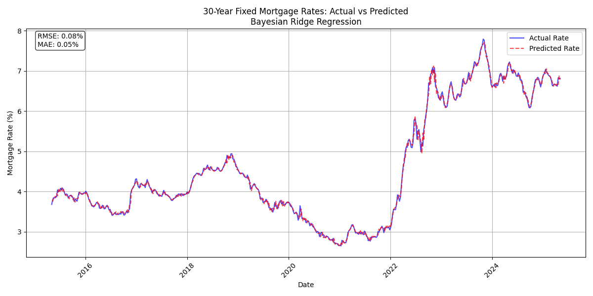

# Mortgage Rate Prediction

A machine learning project to predict 30-year fixed mortgage rates using economic indicators and Federal Reserve data.



## Overview

This project uses various economic indicators and Federal Reserve data to predict future mortgage rates. It implements a Bayesian Ridge Regression model to capture uncertainties in predictions and relationships between different economic factors.

## Features

- Data collection from Federal Reserve Economic Data (FRED)
- Automated weekly predictions
- Time series analysis and visualization
- Email reporting of predictions
- Economic indicators tracked:
  - 10-Year Treasury Yield
  - Federal Funds Rate
  - Consumer Price Index (CPI)
  - Unemployment Rate
  - GDP
  - Housing Market Indicators
  - Money Supply Metrics
  - And more...

## Project Structure

```
mortgage-rate-prediction/
├── data/                # Data storage
├── models/             # Saved models
├── results/            # Results and visualizations
│   └── plots/         # Generated plots
├── src/               # Source code
│   ├── __init__.py
│   ├── config.py      # Configuration settings
│   ├── data_processor.py # Data collection and processing
│   ├── model_trainer.py # Model training logic
│   ├── model_evaluator.py # Model evaluation tools
│   └── utils.py       # Utility functions
└── scripts/           # Scripts for running pipelines
    ├── run_mortgage_prediction.py
    └── generate_email_report.py
```

## Setup

1. Clone the repository:
```bash
git clone https://github.com/yourusername/mortgage-rate-prediction.git
cd mortgage-rate-prediction
```

2. Create a virtual environment and install dependencies:
```bash
python -m venv venv
source venv/bin/activate  # On Windows: venv\Scripts\activate
pip install -r requirements.txt
```

3. Set up your FRED API key:
   - Get an API key from [FRED](https://fred.stlouisfed.org/docs/api/api_key.html)
   - Add it to your environment variables: `FRED_API_KEY=your_key_here`

## Usage

### Running the Prediction Pipeline

```bash
python scripts/run_mortgage_prediction.py
```

### Automated Weekly Predictions

The project includes a GitHub Actions workflow that:
- Runs every Monday at 00:00 UTC
- Collects latest economic data
- Generates new predictions
- Sends an email report with results

## Model Details

The project uses a Bayesian Ridge Regression model which:
- Captures uncertainty in predictions
- Handles missing data and varying scales
- Provides probabilistic predictions
- Updates beliefs based on new data

## Contributing

1. Fork the repository
2. Create your feature branch: `git checkout -b feature/new-feature`
3. Commit your changes: `git commit -am 'Add new feature'`
4. Push to the branch: `git push origin feature/new-feature`
5. Submit a pull request

## License

This project is licensed under the MIT License - see the [LICENSE](LICENSE) file for details.